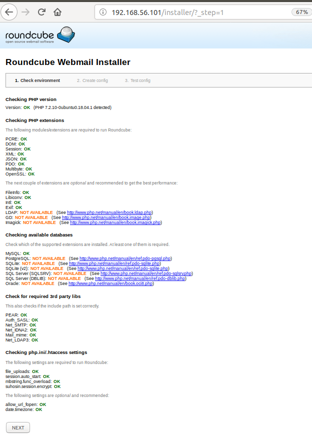
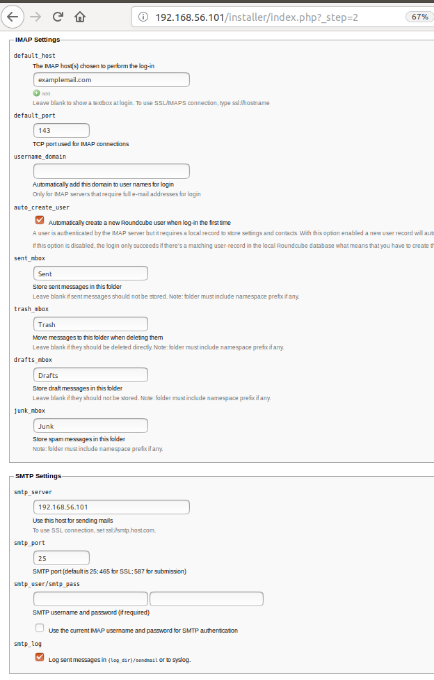
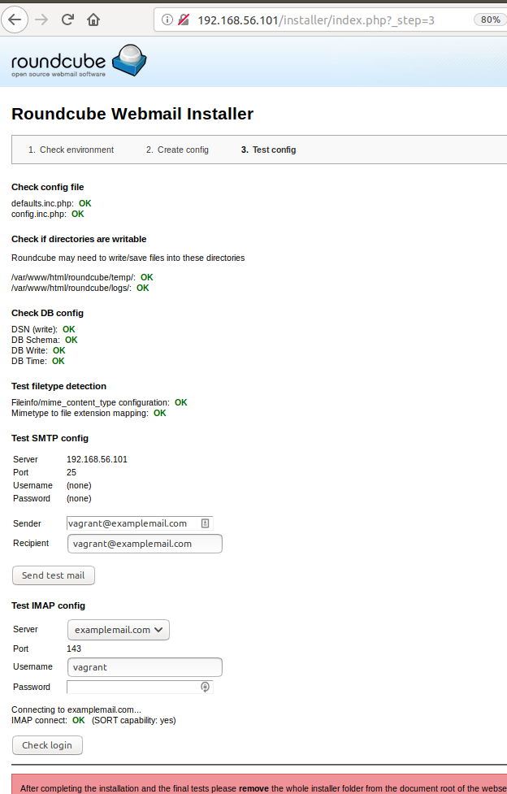

**Install Vagrant:**
        
        sudo apt install vagrant

**start vagrant:**
    
        mkdir email-server
        cd email-server
        vagrant init 
Copy the file Vagrantfile of this repository

        vagrant up
        vagrant ssh

        Password: vagrant

**Update the system:** 

        sudo apt update 
        sudo apt upgrade 

**Install MySQL:**

        sudo apt install mysql-server
        sudo mysql_secure_installation 

In mysql_secure_installation in the first step we indicate NO, it will ask for a password, to the rest of the options we indicate YES.

**Install Apache:**

        sudo apt install apache2 -y 

**Adjust the firewall:**

        sudo ufw enable
        sudo ufw allow in "Apache Full"

Depending on whether the services are in the same virtual machine, we must also open the ports IMAP, POP3 and SMTP:

        sudo ufw imap
        sudo ufw pop3 
        sudo ufw smtp

We can already check in the browser that apache comes out at our address 192.168.56.100

**Install dependencies:**

      sudo apt install php libapache2-mod-php php-mysql php-xml php-mbstring php-intl

In the file "php.ini" we will change date.timezone = "Europe/Madrid" 

        sudo vim /etc/php/7.2/apache2/php.ini

sudo systemctl restart apache2

**Install RoundCube:**

    wget https://github.com/roundcube/roundcubemail/releases/download/1.3.6/roundcubemail-1.3.6-complete.tar.gz
    tar -xvzf roundcubemail-1.3.6-complete.tar.gz
    sudo mv roundcubemail-1.3.6 /var/www/html/roundcube
    sudo chown -R www-data:www-data /var/www/html/roundcube
    sudo chmod -R 775 /var/www/html/roundcube

**Configure MySQL:**

    mysql -u root -p //password
        CREATE DATABASE roundcubemail /*!40101 CHARACTER SET utf8 COLLATE utf8_general_ci */;
        CREATE USER 'roundcube'@'localhost' IDENTIFIED BY 'password';
        GRANT ALL PRIVILEGES ON roundcubemail.* to 'roundcube'@'localhost';
        FLUSH PRIVILEGES;
        EXIT;
    service mysql restart

    If root no deja utentificarse, first do:
        sudo mysql -u root -p 
            ALTER USER 'root'@'localhost' IDENTIFIED WITH mysql_native_password BY 'password';
            FLUSH PRIVILEGES;
            EXIT;

    service mysql restart
    cd /var/www/html/roundcube
    mysql -u roundcube -p roundcubemail < /var/www/html/roundcube/SQL/mysql.initial.sql 

**Configure Apache:**

    sudo cp /etc/apache2/sites-available/000-default.conf /etc/
    sudo vi /etc/apache2/sites-available/roundcube.conf
        ServerName 192.168.56.101
        ServerAdmin examplemail.com
        DocumentRoot /var/www/html/roundcube
        ErrorLog ${APACHE_LOG_DIR}/roundcube-error.log
        CustomLog ${APACHE_LOG_DIR}/roundcube-access.log combined

        <Directory /var/www/html/roundcube>
                Options -Indexes
                AllowOverride All
                Order allow,deny
                allow from all
        </Directory>
    apache2/sites-available/roundcube.conf
    sudo a2dissite 000-default
    sudo a2ensite roundcube
    sudo a2enmod rewrite
    sudo apache2ctl restart

**Install IMAP and POP3:**

    sudo apt install dovecot-imapd -y

**Install Postfic (SMTP):**

    sudo DEBIAN_PRIORITY=low apt-get install postfix
        General type of mail configuration -> Internet site
        System mail name: vagrant.vm
        Root: vagrant
        Other destinations: myhostname, vagrant.vm, localhost.vm, examplemail.com, localhost.
        Force synchronous updates on mail: No
        local networks: 192.168.56.101, 127.0.0/8
        Mailbox size limit:0
        Local addres extension character: +
        Intenet protocols to use: all

**Creates so many user how you want to have mail, we will have mati and sammy:**

    sudo adduser sammy
    sudo usermod -aG sudo sammy
    sudo adduser mati
    sudo usermod -aG sudo mati

service apache2 restart

**Put in browser 192.168.56.100/install, we have Roundcube Webmail Installer:**

- **Check environment:** if it has been missing something, it will tell us and it will not let us go to access  to "create config".

- **Create config:** don't forget put the password mySQL-roundcube, in "The IMAP host choosen to perform the log-in" put "examplemail.com" and in "smtp_server" put "192.168.56.101"

- **Test config:** 

        Sender : vagrant@examplemail.com 
        Recipiente: vagrant@examplemail.com 
        Send test mail : ok

        Username: vagrant  
        Password: vagrant  
        Check login : ok

If everything has gone well, we will be able to put our server (192.168.56.101) in our browser and access it with any of the users that we have created previously..